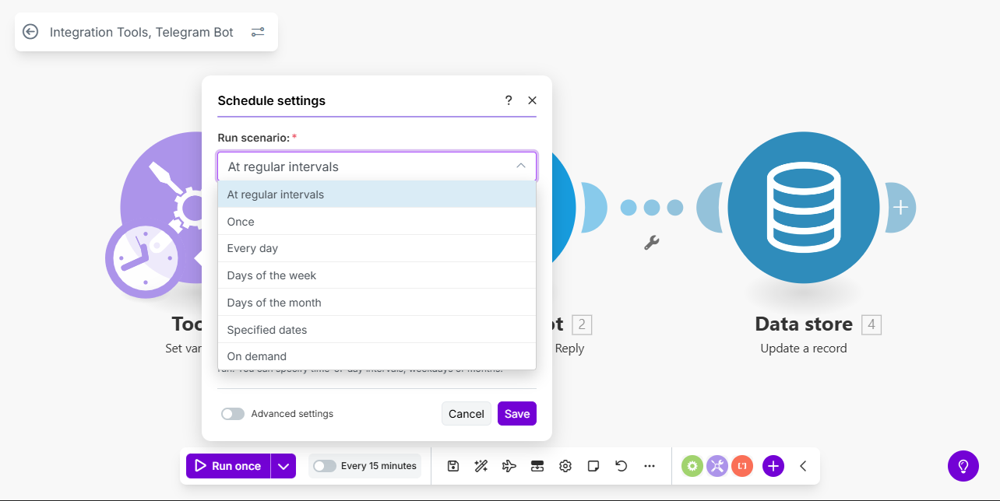
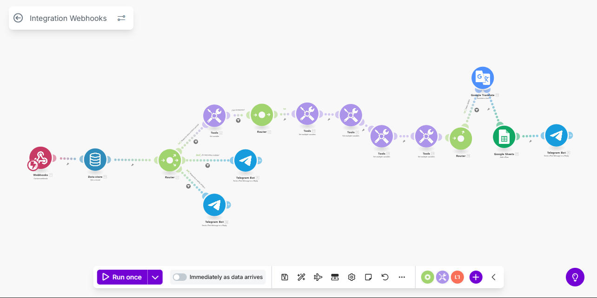
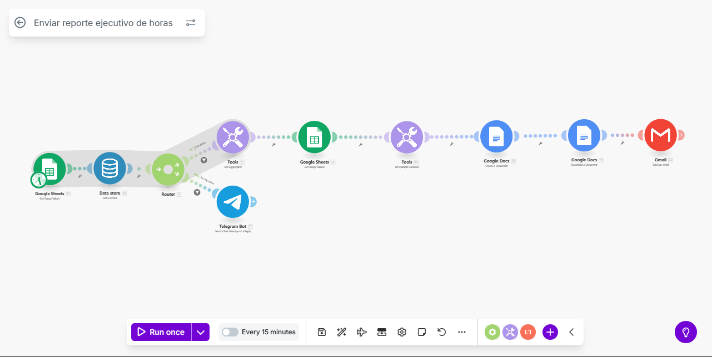
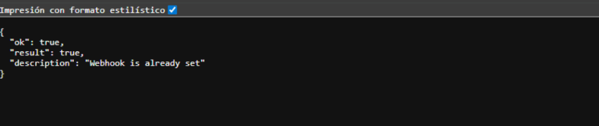

# Sistema de Control de Horas con Telegram y Make

<<<<<<< HEAD
Sistema automatizado para el registro, gestión y reporte de horas de trabajo mediante Telegram Bot y Google Sheets, implementado con Make (Integromat).
=======
Sistema automatizado para el registro, gestión y reporte de horas de trabajo mediante Telegram Bot y Google Sheets, implementado con Make.
>>>>>>> 27d45bb (Actualización README: Se añadio imagenes de cada escenario, información mas amplia de la creación de credenciales y enlaces de ayuda para mas información sobre temas cclave como Telegram Bot, Webhooks y Data Stores)

## 📋 Descripción General

Este sistema consta de **3 escenarios de Make** que trabajan en conjunto para:
- Solicitar el registro diario de horas mediante Telegram
- Procesar y validar la información ingresada
- Generar reportes ejecutivos en PDF y enviarlos por correo

---

## 🔧 Arquitectura del Sistema

### Componentes Principales
- **Telegram Bot**: Interfaz de usuario para el registro
- **Google Sheets**: Base de datos para almacenar registros
- **Google Docs/PDF**: Generación de reportes
- **Gmail**: Envío de reportes por correo
- **Make Data Store**: Almacenamiento de estado del último prompt

---

## 📱 Escenario 1: Integration Tools, Telegram Bot

### Propósito
<<<<<<< HEAD
Enviar un mensaje automatizado a través de Telegram solicitando el registro diario de horas.
=======
Enviar un mensaje automatizado a través de Telegram solicitando el registro diario de horas. 

Este escenario se puede configurar para que cada cierto tiempo envie un mensaje, en este caso como es diario, se utilizaria **Every day** y se configuraria a la hora que se desee que llegue el mensaje cada día:


>>>>>>> 27d45bb (Actualización README: Se añadio imagenes de cada escenario, información mas amplia de la creación de credenciales y enlaces de ayuda para mas información sobre temas cclave como Telegram Bot, Webhooks y Data Stores)

### Flujo de Trabajo

```
┌─────────────────┐
│  Set Variable   │ → Establece fecha actual
└────────┬────────┘
         │
┌────────▼────────┐
│  Send Message   │ → Envía mensaje al usuario via Telegram Bot
└────────┬────────┘
         │
┌────────▼────────┐
│ Update Record   │ → Guarda ID del mensaje en el Data Store
└─────────────────┘
```

<<<<<<< HEAD
=======
Más información sobre **Data Store** y **Data Structures**: [Data Stores](https://help.make.com/data-stores)

>>>>>>> 27d45bb (Actualización README: Se añadio imagenes de cada escenario, información mas amplia de la creación de credenciales y enlaces de ayuda para mas información sobre temas cclave como Telegram Bot, Webhooks y Data Stores)
---

## 🔄 Escenario 2: Integration Webhooks

### Propósito
Procesamiento completo de la información ingresada por el usuario, validación de datos y registro en Google Sheets.

<<<<<<< HEAD
=======


Má información sobre **Webhooks**: [Webhooks](https://apps.make.com/gateway)

>>>>>>> 27d45bb (Actualización README: Se añadio imagenes de cada escenario, información mas amplia de la creación de credenciales y enlaces de ayuda para mas información sobre temas cclave como Telegram Bot, Webhooks y Data Stores)
### Flujo de Trabajo

```
┌──────────────┐
│   Webhook    │ → Recibe mensaje de Telegram
└──────┬───────┘
       │
┌──────▼───────┐
│ Get Record   │ → Obtiene último prompt guardado
└──────┬───────┘
       │
┌──────▼───────────────────────────────────────┐
│            Router Principal                   │
├───────────────┬──────────────┬───────────────┤
│               │              │               │
▼               ▼              ▼               ▼
Respuesta    Formato      Respuesta a      Otras
Válida       Inválido     Prompt Antiguo   Opciones
│               │              │
▼               ▼              ▼
Procesamiento  Error Msg    Error Msg
```
---

## 📊 Escenario 3: Enviar Reporte Ejecutivo de Horas

### Propósito
Generar y enviar automáticamente un reporte ejecutivo en formato PDF con el resumen de horas del período.

<<<<<<< HEAD
=======


>>>>>>> 27d45bb (Actualización README: Se añadio imagenes de cada escenario, información mas amplia de la creación de credenciales y enlaces de ayuda para mas información sobre temas cclave como Telegram Bot, Webhooks y Data Stores)
### Flujo de Trabajo

```
┌──────────────────┐
│  Get Sheet Data  │ → Lee datos de horas (Rango de hoja)
└────────┬─────────┘
         │
┌────────▼─────────┐
│   Get Record     │ → Obtiene ID último prompt
└────────┬─────────┘
         │
┌────────▼──────────────────────────────────┐
│              Router                        │
├────────────────────┬──────────────────────┤
│                    │                      │
▼                    ▼                      
Hay Datos         No Hay Datos
│                    │
▼                    ▼
Generar PDF       Mensaje Error
```
---

## 🔐 Configuración Requerida

### Credenciales y Conexiones

1. **Telegram Bot**
<<<<<<< HEAD
   - Bot Token
   - Chat ID del usuario

2. **Google Services**
   - Google Sheets
   - Google Docs
   - Google Translate API
   - Gmail

3. **Make Data Store**
   - Nombre: `tg_last_prompt`
   - Estructura:
=======
   - Bot Token (obtenido desde BotFather)

   Cómo crear el Telegram Bot y obtener token / chat_id:
   1. Crear el bot (BotFather):
      - En Telegram abre @BotFather y envía /newbot
      - Sigue las instrucciones: elige un nombre y un username (debe terminar en "bot")
      - BotFather te devolverá el Bot Token (formato: 123456:ABC-DEF...)
      - Guarda el token en un lugar seguro (no lo expongas)
      - Más información de Telegram Bot: [Telegrama Bot](https://apps.make.com/telegram)

   2. Webhook (para Make):
      - Al usuar Webhooks, configuramos setWebhook con la URL que Make nos proporciono.

      - Cuando se esta trabajando con Telegram Bot y Webhook, conectamos el token que nos dio Telegram al momento de crear el Bot con la del Webhook. De esta manera (Recordar que es sin los corchetes []): https://api.telegram.org/bot[TU_TOKEN]/setWebhook?url=[URL_DEL_WEBHOOK]

      - Al hacer esto se debería de ver así:
      
   

2. **Google Services**
   - **Google Sheets** &rarr; Simplemente nos logueamos con nuestra cuenta de Google.
   - **Google Docs** &rarr; Simplemente nos logueamos con nuestra cuenta de Google.
   - **Google Translate API**:

      1. Nos dirigimos a [Console Cloud Google](https://console.cloud.google.com/)
      2. Creamos un nuevo proyecto
      3. Colocamos un nombre identificador para ese proyecto (acá vamos a tener la API de Google Translate)
      4. Nos dirigimos a APIs y servicios
      5. Buscamos **Google Translate**
      6. Ingresamos al primer resultado
      7. Le damos habilitar sino esta habilitado
      8. Verificamos que nos salga todo OK.
      9. Le damos al botón de Administrar
      10. Eso nos abre como un panel.
      11. Le damos en credenciales
      12. Nos aparece en Claves de API Traslate
      13. Le damos en **Mostrar clave**
      14. Guardamos esa clave en un lugar seguro para posteriormente usarla en el nodo de Google Transalate dentro del escenario de Make.
   - **Gmail** &rarr; Simplemente nos logueamos con nuestra cuenta de Google.

3. **Make Data Store**
   - Hay dos opciones, la **primera** es directamente en el panal de Make, parte izquierda, aparecen tres puntos, le damos ahí y nos mustra **Data Stores** y lo creamos o directamente desde el escenario lo añadimos y nos pide crear sino tenemos ninguno.
   - Nombre: `tg_last_prompt`
   - **Estructura:**
>>>>>>> 27d45bb (Actualización README: Se añadio imagenes de cada escenario, información mas amplia de la creación de credenciales y enlaces de ayuda para mas información sobre temas cclave como Telegram Bot, Webhooks y Data Stores)
     ```json
     {
       "id": "last_prompt",
       "message_id": number,
       "created_at": date
     }
     ```
---

## 📅 Programación Recomendada

### Escenario 1: Integration Tools
- **Frecuencia:** Diaria
- **Hora:** 08:00 AM

### Escenario 2: Integration Webhooks
- **Tipo:** Webhook (siempre activo)
- **Trigger:** Mensaje recibido en Telegram

### Escenario 3: Enviar Reporte
- **Frecuencia:** Semanal
- **Día:** Domingo
- **Hora:** 8:00 AM

---

## 🚀 Uso del Sistema

### Registro Diario

1. El bot envía mensaje a las 08:00 AM
2. Usuario responde con formato:
   ```
   8:30, 9:15, Reunión con cliente
   ```
3. Sistema valida y procesa:
   - ✅ Horas programadas: 8:30
   - ✅ Horas realizadas: 9:15
   - ✅ Horas extras: 0.75 (calculado)
   - ✅ Observación: Reunión con cliente

4. Confirmación inmediata por Telegram

### Generación de Reportes

<<<<<<< HEAD
1. Ejecución automática cada Domingo
=======
1. Ejecución automática cada cada Domingo
>>>>>>> 27d45bb (Actualización README: Se añadio imagenes de cada escenario, información mas amplia de la creación de credenciales y enlaces de ayuda para mas información sobre temas cclave como Telegram Bot, Webhooks y Data Stores)
2. Sistema recopila datos de la semana
3. Genera documento PDF profesional
4. Envía por correo con resumen

<<<<<<< HEAD
---
=======
---
>>>>>>> 27d45bb (Actualización README: Se añadio imagenes de cada escenario, información mas amplia de la creación de credenciales y enlaces de ayuda para mas información sobre temas cclave como Telegram Bot, Webhooks y Data Stores)
